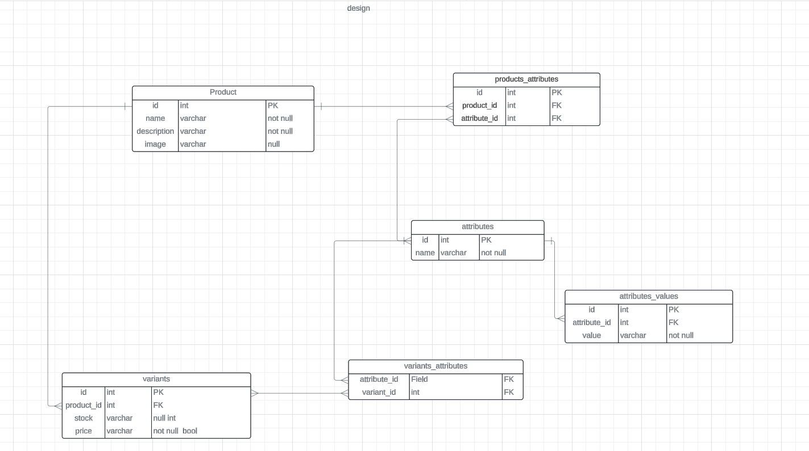

# Product Management System

This is a **Laravel-based product management system** that allows you to manage products with attributes and variants through a simple API.

## Installation

1. **Clone the repository**:
   ```bash
   git clone https://github.com/yourusername/product-management-system.git
   ```

2. **Install dependencies**:
   ```bash
   composer install
   npm install
   ```

3. **Set up the environment**:
    - Copy the `.env` file and set up your environment variables:
      ```bash
      cp .env.example .env
      ```
    - Configure your database credentials in the `.env` file.

4. **Run migrations and seeders**:
    - Run the database migrations:
      ```bash
      php artisan migrate
      ```
    - Seed the database with sample data:
      ```bash
      php artisan db:seed
      ```

5. **Generate the application key**:
   ```bash
   php artisan key:generate
   ```

6. **Start the development server**:
   ```bash
   php artisan serve
   ```
7. **Database design**:
8. 
## API Usage

### Authentication

Before accessing the API, you will need to authenticate via API tokens.

1. Register or log in to get your API token.
2. Add the token to the Authorization header in your API requests or use this token for test 

eyJ0eXAiOiJKV1QiLCJhbGciOiJIUzI1NiJ9.eyJ1c2VyX2lkIjoxMjMsInJvbGUiOiJhZG1pbiIsImV4cCI6MTYzMzY0ODQwMH0.XYZ...


- **GET VARIANT**:
  Send a `POST` request to `/api/get-variation-price`  return the variation price from the selected attributes.


## Hope you like the project thanks for your time 
